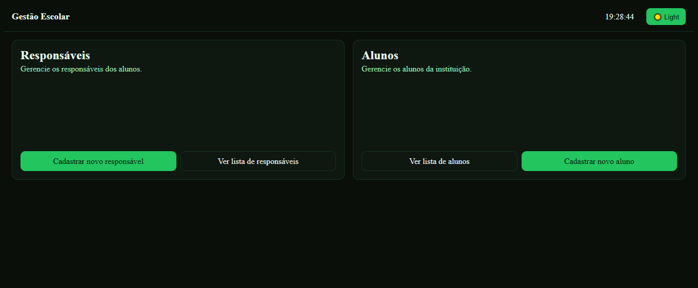

# Gestão Escolar UI

Front‑end em **Angular 20** com **Angular Material**. Este projeto é a interface do sistema de gestão escolar.

---

## 📦 Stack

- **Framework**: Angular ^20.1 (CLI ^20.1)
- **UI**: Angular Material ^20.2
- **Linguagem**: TypeScript ~5.8
- **SSR**: @angular/ssr ^20.1 + Express ^5.1
- **Reatividade**: RxJS ~7.8
- **Zona**: zone.js ~0.15
- **Testes**: Jasmine + Karma
- **Formatação**: Prettier (parser Angular para HTML)

---

## ✅ Páginas do sistema

## Página principal

## Página de listagem de responsáveis

## Página de listagem de alunos

## Página de detalhes de alunos

## Página de detalhes de responsaveis

## Página de formulario de novo aluno

## Página de formulario de novo responsavel
